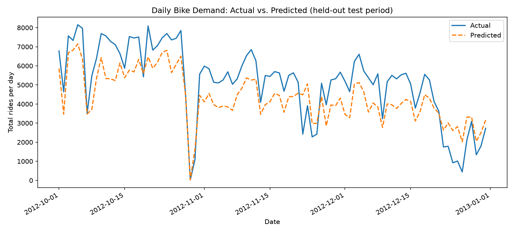
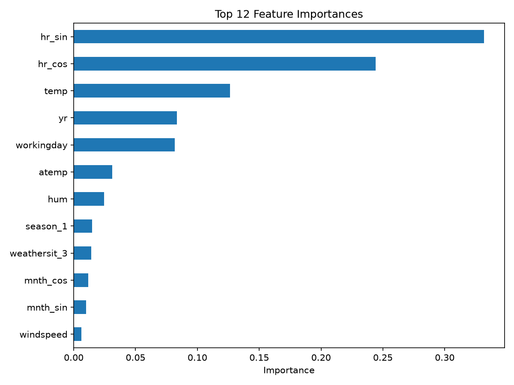

# Bike-Share Hourly Demand Forecaster

Predicts how many bike-share rides to expect in a given hour, so an operator
can decide how many bikes to move to which docks ahead of time
("rebalancing"). Under-predict and docks run empty during rush hour;
over-predict and bikes sit unused instead of being moved somewhere they're
needed.

This is framed as a small production-style pipeline rather than a single
notebook: **the model itself is easy — a couple of scikit-learn regressors
on tabular data — the engineering around it (an honest evaluation split,
reproducible artifacts, a CLI) is the actual point.**

## Data

[UCI Bike Sharing Dataset](https://archive.ics.uci.edu/dataset/275/bike+sharing+dataset)
— 17,379 hourly records from Capital Bikeshare (Washington D.C.), Jan 2011
through Dec 2012, with weather conditions, season, holiday/working-day
flags, and the target `cnt` (total rides that hour).

## The key engineering decision: a time-based split, not a random one

Most beginner projects on this dataset use `train_test_split` with
shuffling. That's a mistake here: adjacent hours are highly correlated (rush
hour today looks like rush hour yesterday), so a random split lets the model
train on hours immediately before and after a given test hour. The
resulting score looks great in development and would not hold up in
production, where you only ever have the past to predict the future.

Instead, this project splits **chronologically**: train on Jan 2011 – Sep
2012, test on Oct – Dec 2012 (`config.yaml` → `split.test_start_date`,
implemented in [`src/train.py`](src/train.py)). It's a strictly harder
evaluation, and the results below reflect that honestly.

## Results

Two models are trained and compared on the held-out (future) test set:

| Model | MAE (rides/hour) | RMSE |
|---|---|---|
| Linear Regression | 112.39 | 148.12 |
| **Random Forest** (selected) | **56.66** | **82.30** |

The Random Forest is saved as the production model
(`models/model.joblib`); full metrics are in `models/metrics.json`.

**Actual vs. predicted demand, daily totals over the test period:**



**What matters most to the model:**



Hour-of-day (`hr_sin`/`hr_cos`) dominates, as expected for a commuter
system — followed by temperature, year, and working-day status.

### Known limitation

The chart shows the model consistently *under-predicting* through most of
the test period. This isn't noise — it's a structural limitation of
tree-based models: a Random Forest predicts by averaging training examples
in a leaf, so it cannot extrapolate a continuing growth trend (ridership
grew steadily through 2012 as the system matured) beyond the range of
values it was trained on. A model with an explicit trend/seasonality
component (e.g. gradient boosting with a time index, or a proper
time-series model) would likely close this gap — noted here as a natural
next step rather than papered over.

## Project structure

```
├── data/raw/hour.csv          # downloaded dataset (gitignored)
├── src/
│   ├── download_data.py       # fetches + extracts the UCI dataset
│   ├── features.py            # cyclical encoding, leakage-column removal
│   ├── train.py                # time-based split, trains + compares models, saves artifacts
│   ├── evaluate.py            # re-scores the saved model, generates plots
│   └── predict.py             # CLI: predict demand for one hour's conditions
├── tests/test_features.py     # unit tests on feature engineering + split logic
├── models/                    # saved model, metrics.json, plots
├── config.yaml                # paths, split date, model hyperparameters
└── requirements.txt
```

## How to run

```bash
python3 -m venv .venv && source .venv/bin/activate
pip install -r requirements.txt

# 1. Download the dataset (idempotent — skips if already present)
python -m src.download_data

# 2. Train + compare models on the time-based split, save the best one
python -m src.train

# 3. Re-evaluate the saved model on the held-out test set, generate plots
python -m src.evaluate

# 4. Predict demand for a specific hour's conditions
python -m src.predict --hour 18 --month 6 --season 3 \
    --weather 1 --workingday 1 --temp 0.7 --humidity 0.5 --windspeed 0.2
# -> Predicted rides for hour 18: 798

# Run the test suite
pytest tests/
```

`--temp`/`--humidity`/`--windspeed` are normalized 0–1, matching the
dataset's encoding (see `--help` for the full flag reference, including
`--weekday`, `--holiday`, `--year`, `--atemp`).

## What this demonstrates

- Choosing an evaluation strategy that matches how the model will actually
  be used, not just what's convenient (`time_based_split` vs. random split).
- Comparing multiple models on the same honest split rather than tuning one
  blindly.
- Avoiding target leakage (`casual` + `registered` sum to `cnt` — dropped).
- Domain-appropriate feature engineering (cyclical hour/month encoding).
- Shipping reproducible artifacts (`model.joblib`, `metrics.json`) instead
  of leaving results stranded in a notebook.
- Being explicit about a model's limitations instead of only reporting the
  headline metric.
